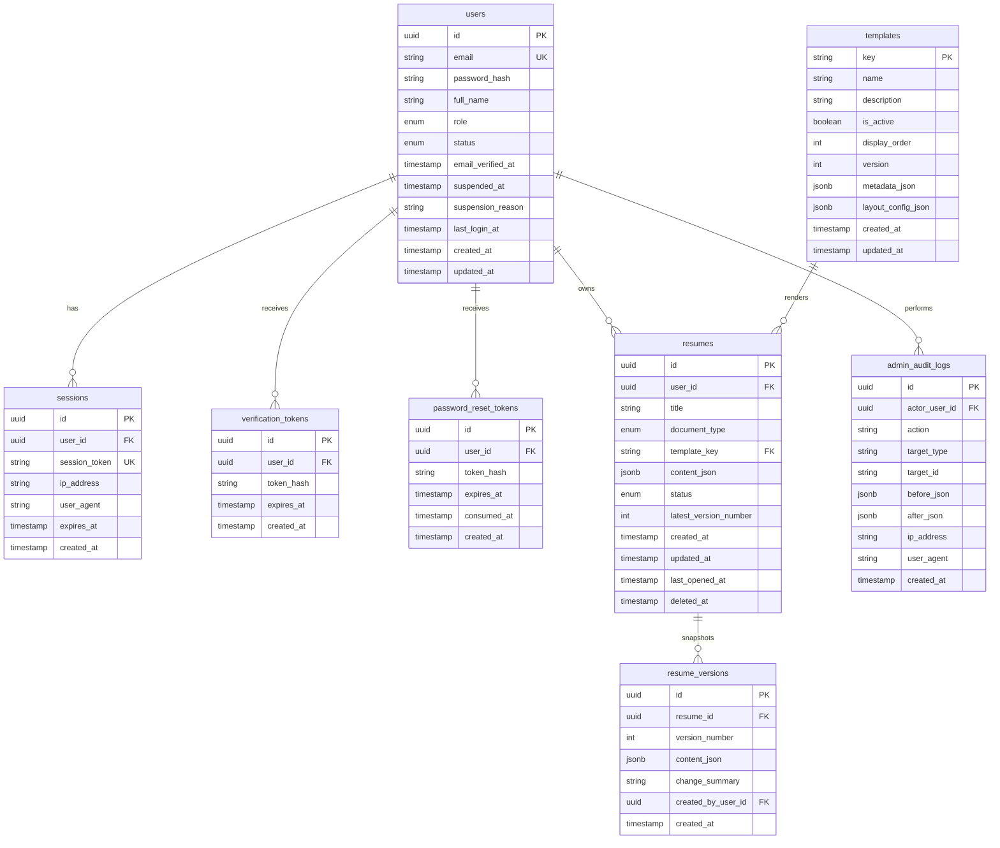

# Database Schema

## Storage Principles

- The database stores only authenticated user data and operational metadata.
- Guest drafts never reach the database.
- Resume content is stored as JSONB so template rendering stays decoupled from storage columns.
- Version history is append-only.
- Soft-delete is used for user-facing recovery; hard purge happens later by retention policy.

## Logical ERD

## Table Definitions

## `users`

- Stores all registered users.
- `role` enum: `user`, `admin`
- `status` enum: `active`, `suspended`
- Unique index on `email`
- Partial index on `status` for admin filtering

## `sessions`

- Session records for Auth.js credentials sessions
- Unique index on `session_token`
- Index on `user_id`
- Expired sessions may be pruned by scheduled cleanup

## `verification_tokens`

- Used for email verification
- Only store hashed tokens
- Unique composite index on `(user_id, token_hash)`

## `password_reset_tokens`

- Used for password reset flow
- `consumed_at` ensures one-time token usage
- Unique composite index on `(user_id, token_hash)`

## `resumes`

- Single current working copy per saved document
- `document_type` enum: `resume`, `cv`
- `status` enum: `active`, `archived`
- Indexes:
  - `(user_id, updated_at desc)` for dashboard listing
  - `(user_id, status)` for filters
  - partial index on `deleted_at is null`

## `resume_versions`

- Immutable snapshots of resume state
- Unique composite index on `(resume_id, version_number)`
- Index on `created_at` for version history retrieval

## `templates`

- Holds system-curated template catalog
- `key` values for v1: `atlas`, `summit`, `quill`, `northstar`
- `metadata_json` stores preview and marketing metadata
- `layout_config_json` stores rendering tokens, not executable code

## `admin_audit_logs`

- Append-only log of privileged actions
- Indexes on `actor_user_id`, `target_type`, `created_at`
- Retain for at least 365 days

## Data Lifecycle

- Guest drafts: browser storage only, TTL 7 days
- Saved resumes: live until user deletes
- Soft-deleted resumes: retain 30 days, then purge by job
- Versions: retain while parent resume exists; purge permanently with parent after retention window
- Audit logs: retain minimum 365 days

## Authorization Rules

- All queries on `resumes` and `resume_versions` must filter by authenticated `user_id`.
- Non-admin users never query `admin_audit_logs`.
- Template reads are public only for active templates; inactive templates are admin-only.
- Suspension status blocks login and authenticated mutations.

## Migration Sequence

1. Create auth tables.
2. Create templates table and seed four templates.
3. Create resumes and resume_versions tables.
4. Create admin_audit_logs table.
5. Add indexes and retention jobs.
